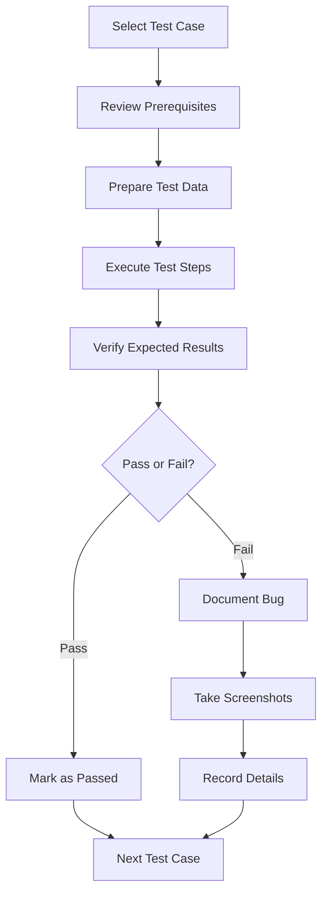

# Test Execution Guide

This guide explains how to execute the manual test cases for the Tennis Tracking App authentication flows.

## Table of Contents
- [Prerequisites](#prerequisites)
- [Test Environment Setup](#test-environment-setup)
- [Executing Test Cases](#executing-test-cases)
- [Recording Test Results](#recording-test-results)
- [Troubleshooting](#troubleshooting)
- [Best Practices](#best-practices)

---

## Prerequisites

### Required Access
- ✅ Supabase project admin access (for viewing users, database)
- ✅ Test email account (for email verification testing)
- ✅ Modern web browser (Chrome, Firefox, Edge, or Safari)
- ✅ Access to application source code (for debugging if needed)

### Recommended Tools
- Browser DevTools (for inspecting network requests, console logs)
- Email client or webmail access
- Spreadsheet or test management tool (for tracking results)
- Screen recording software (optional, for bug reports)

---

## Test Environment Setup

### 1. Start the Application

```bash
# Navigate to project directory
cd c:\namtranhoai\13. Tennis\tennis-tracking-app

# Install dependencies (if not already done)
npm install

# Start development server
npm run dev
```

The application should be running at `http://localhost:5173` (or the port shown in terminal).

### 2. Verify Supabase Configuration

Check that Supabase is properly configured:

1. Open browser DevTools (F12)
2. Navigate to the app
3. Check Console for any Supabase connection errors
4. Verify no "Invalid API key" or connection errors appear

### 3. Prepare Test Email Account

Set up a test email account for receiving verification emails:

- **Option 1**: Use a real email service (Gmail, Outlook, etc.)
- **Option 2**: Use a temporary email service (for quick testing)
- **Option 3**: Use email aliases (e.g., `yourname+test1@gmail.com`)

### 4. Clean Test Environment

Before starting tests:

1. **Clear browser data**:
   - Open incognito/private window, OR
   - Clear cookies and local storage for `localhost:5173`

2. **Clean test data** (if reusing test accounts):
   - Delete previous test users from Supabase Auth
   - Delete test profiles from database
   - Delete test teams and memberships

---

## Executing Test Cases

### Test Execution Workflow



### Step-by-Step Execution

#### 1. **Select Test Case**
- Open [auth-flow-test-cases.md](./auth-flow-test-cases.md)
- Choose a test case to execute (e.g., TC-SIGNUP-001)
- Read the entire test case before starting

#### 2. **Verify Prerequisites**
- Ensure all preconditions are met
- Prepare required test data
- Set up browser environment (incognito mode recommended)

#### 3. **Execute Test Steps**
- Follow each step in the test case **exactly as written**
- Perform actions in the specified order
- Observe the application behavior after each step

#### 4. **Verify Expected Results**
- Compare actual results with expected results
- Check all specified outcomes
- Note any deviations or unexpected behavior

#### 5. **Record Results**
- Mark test as **PASS** if all expected results match
- Mark test as **FAIL** if any expected result doesn't match
- Mark test as **BLOCKED** if prerequisites cannot be met
- Document any issues found

---

## Recording Test Results

### Test Results Template

Create a test results document or spreadsheet with these columns:

| Test ID | Test Name | Status | Execution Date | Tester | Notes | Bug ID |
|---------|-----------|--------|----------------|--------|-------|--------|
| TC-SIGNUP-001 | Successful User Registration | PASS | 2025-11-26 | John | - | - |
| TC-SIGNUP-002 | Invalid Email Format | PASS | 2025-11-26 | John | - | - |
| TC-LOGIN-002 | Unverified Email | FAIL | 2025-11-26 | John | Error message not showing | BUG-001 |

### Status Values
- **PASS** ✅ - All expected results achieved
- **FAIL** ❌ - One or more expected results not achieved
- **BLOCKED** 🚫 - Cannot execute due to missing prerequisites
- **NOT RUN** ⏸️ - Not yet executed

### Bug Report Template

When a test fails, document the bug:

```markdown
**Bug ID**: BUG-XXX
**Test Case**: TC-XXX-XXX
**Severity**: Critical / High / Medium / Low
**Priority**: P0 / P1 / P2 / P3

**Summary**: Brief description of the issue

**Steps to Reproduce**:
1. Step 1
2. Step 2
3. Step 3

**Expected Result**: What should happen

**Actual Result**: What actually happened

**Screenshots**: [Attach screenshots]

**Environment**:
- Browser: Chrome 120
- OS: Windows 11
- App Version: v0.0.0
- Date: 2025-11-26

**Additional Notes**: Any other relevant information
```

---

## Troubleshooting

### Common Issues and Solutions

#### Issue 1: Email Verification Not Received

**Symptoms**: After signup, no verification email arrives

**Solutions**:
1. Check spam/junk folder
2. Verify Supabase email settings are configured
3. Check Supabase logs for email delivery errors
4. Try a different email address
5. Check email service rate limits

**Workaround**: Manually verify user in Supabase Auth dashboard

---

#### Issue 2: Infinite Loading Spinner

**Symptoms**: App shows loading spinner indefinitely

**Solutions**:
1. Check browser console for errors
2. Verify Supabase connection is working
3. Check network tab for failed requests
4. Wait for timeout (15 seconds) to see error message
5. Refresh the page

**Debugging**:
```javascript
// Open browser console and check:
console.log('User:', user);
console.log('Team Membership:', teamMembership);
console.log('Loading:', loading);
```

---

#### Issue 3: Redirect Loop

**Symptoms**: Page keeps redirecting between routes

**Solutions**:
1. Clear browser cache and cookies
2. Check browser console for redirect logs
3. Verify user's team membership status in database
4. Log out and log back in
5. Check for conflicting auth state

---

#### Issue 4: "Failed to Load" Errors

**Symptoms**: Error messages about failed data loading

**Solutions**:
1. Verify Supabase is running and accessible
2. Check API keys in `.env` file
3. Verify database tables exist
4. Check Row Level Security (RLS) policies
5. Review browser console for specific error messages

---

#### Issue 5: Cannot Access Protected Routes

**Symptoms**: Always redirected to login or choose-team

**Solutions**:
1. Verify user is logged in (check DevTools → Application → Local Storage)
2. Check team membership status in database
3. Ensure membership status is 'approved'
4. Refresh membership data
5. Try logging out and back in

---

## Best Practices

### Before Testing
- ✅ Always use incognito/private browsing mode
- ✅ Clear browser cache between test runs
- ✅ Have DevTools open to monitor console logs
- ✅ Prepare all test data before starting
- ✅ Read the entire test case before executing

### During Testing
- ✅ Follow test steps exactly as written
- ✅ Wait for loading states to complete
- ✅ Take screenshots of failures immediately
- ✅ Note any unexpected behavior
- ✅ Check browser console for errors
- ✅ Verify network requests in DevTools

### After Testing
- ✅ Record all results immediately
- ✅ Document bugs with detailed steps
- ✅ Clean up test data if needed
- ✅ Share results with development team
- ✅ Update test cases if application behavior changed

### Testing Tips
- 🎯 Test one scenario at a time
- 🎯 Don't skip steps, even if they seem obvious
- 🎯 Test both happy paths and error cases
- 🎯 Pay attention to loading states and transitions
- 🎯 Verify data persistence (refresh page and check)
- 🎯 Test on different browsers if possible
- 🎯 Document any unclear or ambiguous behavior

---

## Test Coverage Checklist

Use this checklist to ensure comprehensive testing:

### Signup Flow
- [ ] Valid signup with all required fields
- [ ] Invalid email format validation
- [ ] Short password validation
- [ ] Empty fields validation
- [ ] Existing email handling
- [ ] Email confirmation flow
- [ ] Redirect when already logged in

### Login Flow
- [ ] Successful login with approved team
- [ ] Login with unverified email
- [ ] Invalid credentials
- [ ] Login without team membership
- [ ] Login with pending membership
- [ ] Empty fields validation
- [ ] Redirect when already logged in

### Team Selection
- [ ] Create new team
- [ ] Join existing team
- [ ] Prevent multiple team memberships
- [ ] Empty team name validation
- [ ] No teams available scenario

### Protected Routes
- [ ] Access without authentication
- [ ] Access without team membership
- [ ] Loading timeout handling
- [ ] Proper redirects based on auth state

### Logout
- [ ] Successful logout
- [ ] Session cleared
- [ ] Cannot access protected routes after logout

### Email Verification
- [ ] Click verification link
- [ ] Expired link handling (if applicable)

---

## Quick Start Guide

**For first-time testers:**

1. **Setup** (5 minutes)
   ```bash
   npm run dev
   ```
   Open `http://localhost:5173` in incognito mode

2. **Run Critical Tests** (15 minutes)
   - TC-SIGNUP-001: Successful signup
   - TC-EMAIL-001: Email verification
   - TC-LOGIN-001: Successful login
   - TC-TEAM-001: Create team
   - TC-PROTECTED-001: Protected route access

3. **Record Results**
   - Use the test results template
   - Document any failures

4. **Report**
   - Share results with team
   - Create bug reports for failures

---

## Additional Resources

- **Test Cases Document**: [auth-flow-test-cases.md](./auth-flow-test-cases.md)
- **Supabase Dashboard**: Check your Supabase project URL
- **Application Logs**: Browser DevTools → Console
- **Network Requests**: Browser DevTools → Network tab

---

## Contact & Support

If you encounter issues not covered in this guide:

1. Check browser console for error messages
2. Review Supabase logs
3. Consult with development team
4. Document the issue for future reference

---

**Last Updated**: 2025-11-26  
**Version**: 1.0  
**Maintained By**: Development Team
